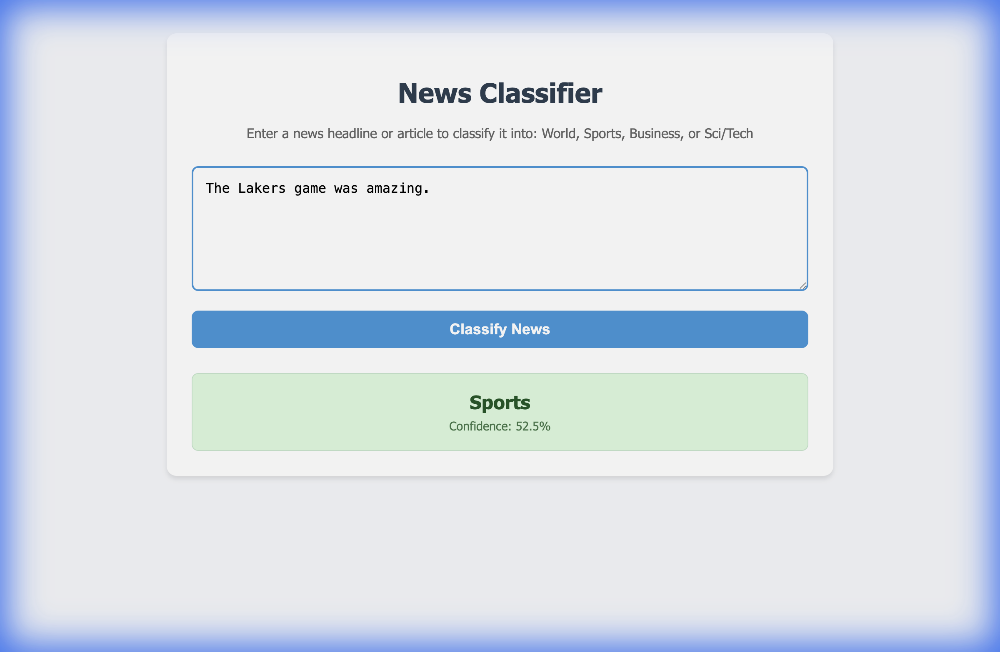
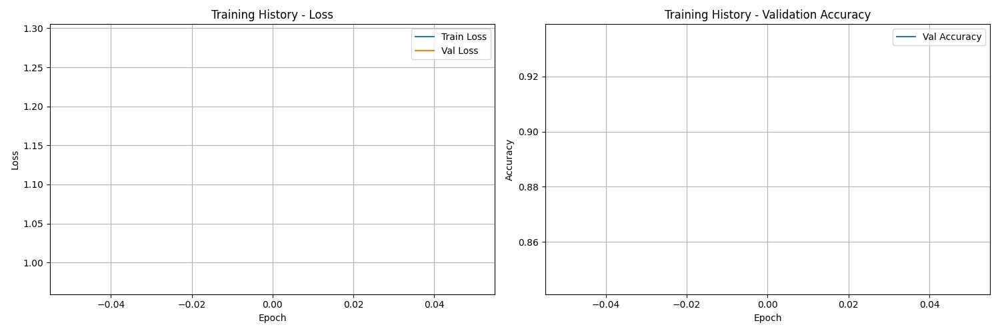

# BERT Text Classification

A comprehensive project for fine-tuning BERT (specifically DistilBERT) for multi-class news article classification using the AG News dataset. This project implements the full pipeline from data preparation (via Kaggle) to model evaluation, attention visualization, and a local Web GUI.

## 📋 Project Overview

This project classifies news articles into four categories:
- **World**
- **Sports**
- **Business**
- **Sci/Tech**

## 🚀 Features

- **Dataset Integration**: Automatically downloads dataset from Kaggle (with fallback to direct mirror).
- **Model Fine-tuning**: Fine-tune DistilBERT with configurable hyperparameters.
- **Web GUI**: Simple Flask-based web interface for real-time inference.
- **Comprehensive Evaluation**: Accuracy, F1-score, confusion matrix, and reporting.
- **Attention Visualization**: Visualize attention weights to understand model behavior.
- **MPS Support**: Optimized for Mac (Apple Silicon) acceleration.

## 📁 Project Structure

```
BERT-Text-Classification/
├── app.py                 # Web GUI for inference
├── data_preparation.py    # Data download (Kaggle/Mirror) and cleaning
├── dataset.py             # Custom Dataset class
├── trainer.py             # Training loop
├── attention_viz.py       # Visualization
├── main.py                # Entry point
├── requirements.txt       # Dependencies
└── README.md              # Documentation
```

## 🛠️ Installation

1. Clone the repository:
```bash
git clone <repository-url>
cd BERT-Text-Classification
```

2. Install dependencies:
```bash
pip install -r requirements.txt
```

3. **Kaggle Setup (Optional)**:
   To download the dataset directly from Kaggle, ensure you have your `kaggle.json` key in `~/.kaggle/kaggle.json`.
   If not present, the script will automatically fallback to a direct download mirror, so you can run it without keys too!

## 📊 Process

### 1. Data Preparation
Download and prepare the AG News dataset:
```bash
python data_preparation.py
```
This will download `ag_news` and split it into train/val/test sets in the `data/` directory.

### 2. Training
Train the model. Default is 3 epochs, but you can run for 1 epoch to test quickly:
```bash
python main.py --epochs 3 --data_dir data --output_dir outputs
```

### 3. Web GUI
Run the local web interface to test the model:
```bash
python app.py
```
Open your browser at `http://localhost:5000`.

## 📈 Evaluation

Results are saved in the `outputs/` directory:
- `training_history.png`: Loss and accuracy curves.
- `confusion_matrix_validation.png`: Confusion matrix.
- `best_model_epoch_{N}.pt`: Saved model checkpoints.

## 🔍 Screenshots

### Web Interface


### Training History


## 📄 License
MIT
